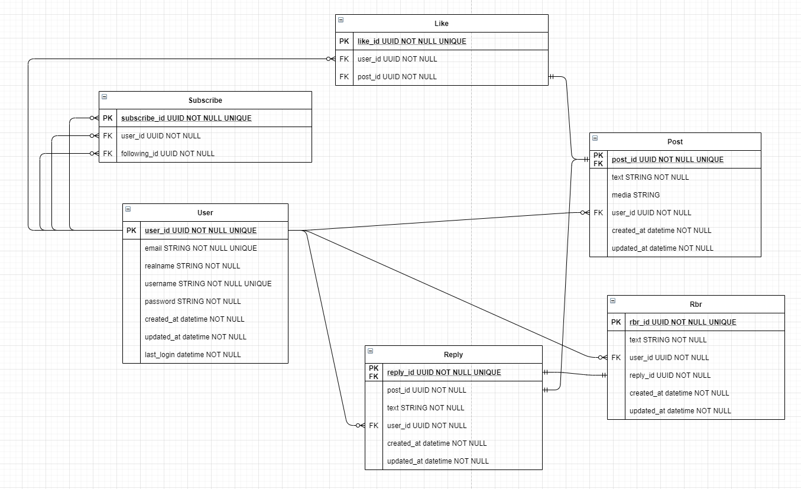

# 인스타그램 클론코딩 백엔드

- [인스터그램 클론코딩 프론트엔드](https://github.com/Sustagram/instagram-clone-front)

## 🐍 Python3 Version
- v3.7.9

## 🚀 시작하기

- venv 사용을 권장

### 📑 의존성 설치

```shell script
pip install -r ./requirements.txt
```

### 💻 개발 서버 시작하기

```shell script
python ./manage.py runserver
```

## ⚙ Database Model (Old)


## 🛠 Environment Variables

- `.env`로 파일을 만들어 내용을 추가합니다.

- `.env.example`에 예시가 나와있습니다.

- `DB_HOST`
  - 데이터베이스 주소
- `DB_PORT`
  - 데이터베이스 포트
- `DB_DATABASE`
  - 데이터베이스 이름
- `DB_USERNAME`
  - 데이터베이스 유저
- `DB_PASSWORD`
  - 데이터베이스 비밀번호
- `SECRET_KEY`
  - 장고 시크릿 키
- `DEBUG`
  - 장고 디버그 모드 여부 (TRUE or FALSE)
